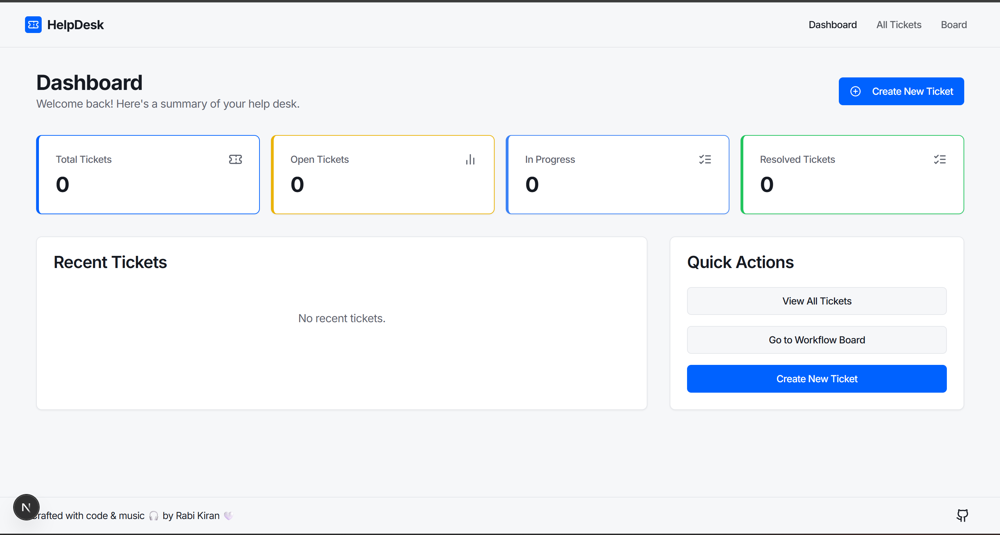
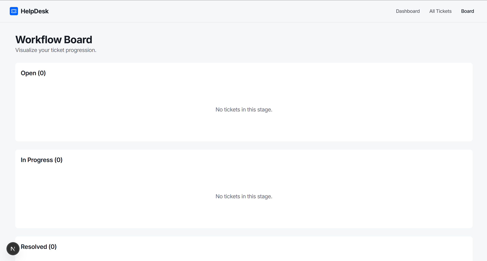
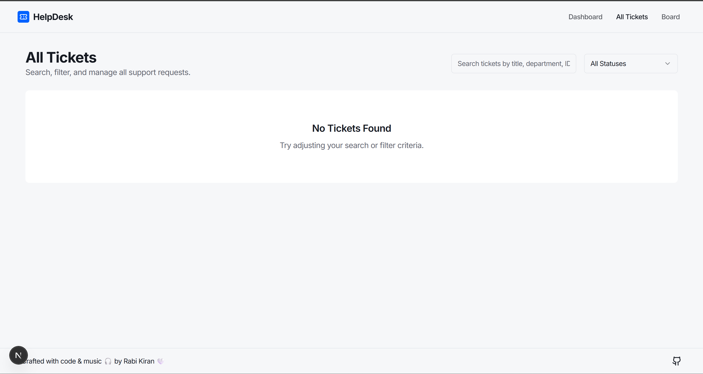
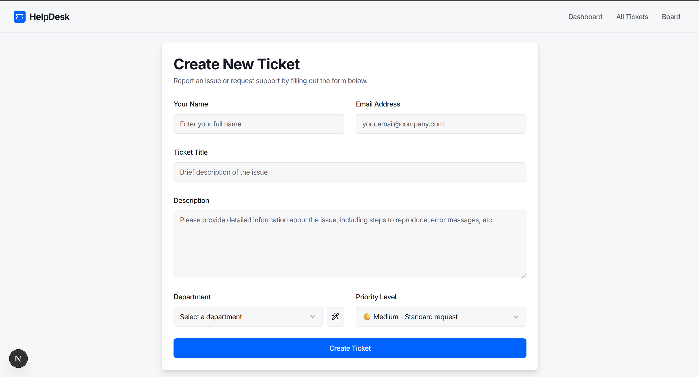

# ✨ HelpDesk - AI-Powered Ticket Raising Platform ✨

<div align="center">

**A modern, responsive help desk and ticket management application built with Next.js, TypeScript, and ShadCN UI.**

</div>

<div align="center">

[](https://opensource.org/licenses/MIT)
[](https://nextjs.org/)
[](https://tailwindcss.com/)

</div>

---

## 🚀 Project Overview

HelpDesk is a modern, responsive help desk and ticket management platform. It features a dashboard, comprehensive ticket list, and a workflow board. All state is managed client-side using React Context and localStorage. There is no backend or AI integration at this time.

---

## 🌟 Key Features

- **📊 Dashboard:** Overview of total, open, in-progress, and resolved tickets, plus recent activity.
- **🎫 Ticket Management:** Filter, search, and update tickets. Edit priority and status directly from the list.
- **🗂️ Workflow Board:** Visualize ticket progression with a vertical workflow (Open, In-Progress, Resolved, Closed).
- **📄 Detailed Ticket Modal:** View ticket details in a responsive modal.
- **📱 Responsive Design:** Clean, modern UI with ShadCN and Tailwind CSS for desktop and mobile.
- **🦾 Accessibility:** Keyboard navigation and accessible dialogs.

---

## 🛠️ Tech Stack

| Category          | Technology                                                                                                  |
| ----------------- | ----------------------------------------------------------------------------------------------------------- |
| **Framework**     | [Next.js](https://nextjs.org/) (App Router)                                                                |
| **Language**      | TypeScript                                                                                                 |
| **Styling**       | [Tailwind CSS](https://tailwindcss.com/)                                                                    |
| **UI Components** | [ShadCN UI](https://ui.shadcn.com/)                                                                         |
| **State Mgt.**    | React Context API                                                                                           |
| **Persistence**   | Browser localStorage                                                                                        |

---

## 🗃️ Data Model

**Ticket**
- `id`: number
- `title`: string
- `description`: string
- `department`: string
- `priority`: low" | medium" | high"
- `status`: "open" |in-progress | esolved" | "closed- `requesterName`: string
- `requesterEmail`: string
- `createdAt`: ISO string
- `updatedAt`: ISO string

---

## 📸 Screenshots

> **Note:**
> - All screenshots are located in the `public/screenshots` folder and are served from there in the running app and referenced in this README.

### Dashboard

*The main dashboard provides at-a-glance statistics and a list of recent tickets.*

### Workflow Board

*A vertical workflow board to visualize and manage the ticket lifecycle.*

### All Tickets Page

*Search, filter, and manage all support tickets from a centralized list.*

### Create Ticket Page

*An intuitive form for creating new tickets.*

---

## 🏁 Getting Started

To get a local copy up and running, follow these steps.

### Prerequisites

Make sure you have the following installed on your system:
- [Node.js](https://nodejs.org/) (v18or newer)
-npm](https://www.npmjs.com/) or [yarn](https://yarnpkg.com/)

### Installation

1. **Clone the Repository**
    ```sh
    git clone https://github.com/Rabikiran67/ticket-raising-platform.git
    ```
2. **Navigate to the Project Directory**
    ```sh
    cd ticket-raising-platform
    ```
3. **Install NPM Packages**
    ```sh
    npm install
    ```

### Running the Application

1. **Start the Development Server**
    ```sh
    npm run dev
    ```
2. **Open Your Browser**
    Navigate to [http://localhost:9002](http://localhost:9002) to see the application in action.

---

## 💡 Usage

- **Dashboard:** View ticket stats and recent activity.
- **Create a Ticket:** Use the "Create Ticket page.- **Manage Tickets:** Use the All Tickets" page to filter, search, and update tickets.
- **Track Progress:** Use the "Workflow Board" to view tickets by status.
- **View Details:** Click a ticket to open a modal with full details.

---

## 🏗️ Architecture

- **Frontend:** Next.js (App Router), TypeScript, Tailwind CSS, ShadCN UI.
- **State Management:** React Context API, all ticket data is stored in browser localStorage.
- **No backend or authentication yet** (planned for future releases).

---

## 🚀 Future Plans

- [ ] **User Authentication & Roles:** Sign-up/sign-in, admin/agent/client roles.
- [ ] **Advanced Analytics:** Charts and graphs for ticket resolution, agent performance, and trends.
- [ ] **Email Notifications:** Notify users and agents of ticket updates and status changes.
- [ ] **Knowledge Base:** Integrated FAQ and knowledge articles.
- [ ] **Full-Featured Dark Mode:** Theme toggle for light/dark modes.

---

## 🤝 Contributing

Contributions are what make the open-source community amazing! Any contributions you make are **greatly appreciated**.

If you have a suggestion, please fork the repo and create a pull request. You can also open an issue with the tag enhancement".

1. Fork the Project
2. Create your Feature Branch (`git checkout -b feature/AmazingFeature`)
3. Commit your Changes (`git commit -mAdd some AmazingFeature`)
4.Push to the Branch (`git push origin feature/AmazingFeature`)
5. Open a Pull Request

Don't forget to give the project a star! Thanks again!

---

## 📄 License

Distributed under the MIT License. See `LICENSE.txt` for more information.

---

## 📫 Contact

Rabi Kiran - [Portfolio](https://rabi-kiran-web.vercel.app/)

Project Link: [Github Repo](https://github.com/Rabikiran67/ticket-raising-platform)

<div align=center">

---
**Crafted with code & music 🎧 by Rabi Kiran 🤍**
</div> 