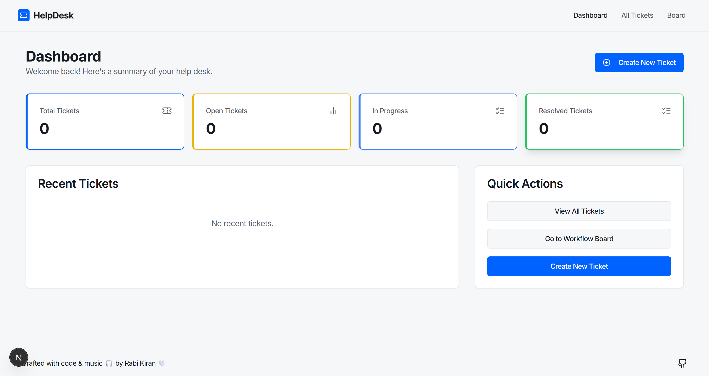
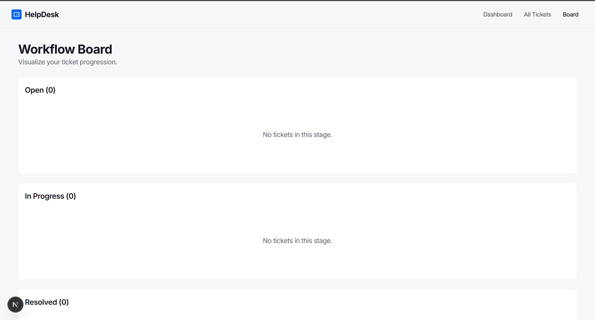
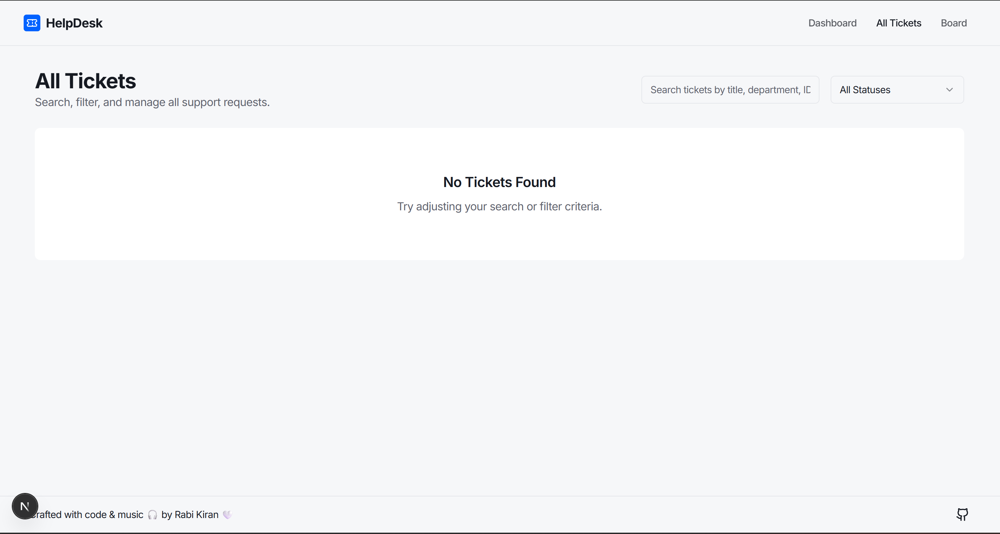
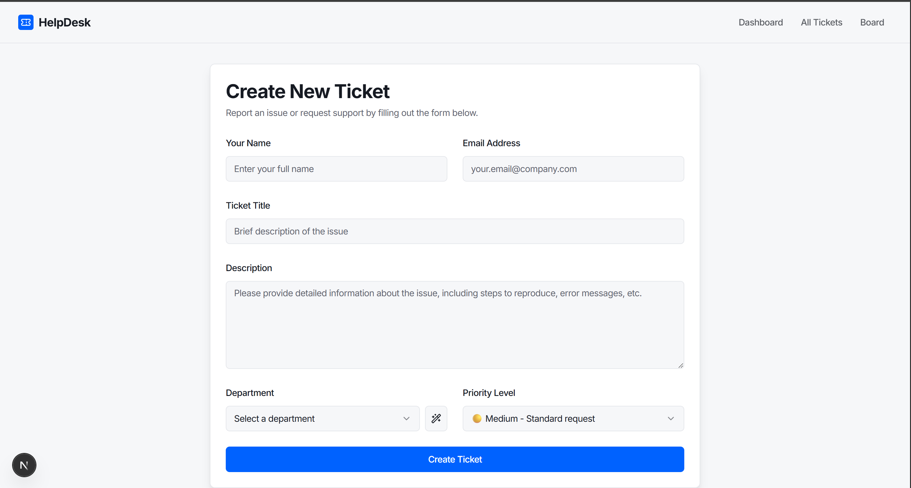

# ✨ HelpDesk - AI-Powered Ticket Raising Platform ✨

<div align="center">

**A modern, responsive help desk and ticket management application built with Next.js, Genkit for AI features, and ShadCN for the user interface.**

</div>

<div align="center">

[](https://opensource.org/licenses/MIT)
[](https://nextjs.org/)
[](https://www.typescriptlang.org/)
[](https://tailwindcss.com/)
[](https://firebase.google.com/docs/genkit)

</div>

**Live Demo:** [https://your-website-link.com](https://your-website-link.com)

---

## 🚀 Project Overview

This application provides a complete solution for managing support requests. It features a statistical dashboard, a comprehensive ticket list with filtering, a Kanban-style board to visualize workflow, and an AI-powered assistant to suggest the correct department when a new ticket is created.

---

## 🌟 Key Features

*   **📊 Interactive Dashboard:** Get a quick overview of key metrics like total tickets, open tickets, in-progress tickets, and resolved tickets.
*   **🤖 AI-Powered Department Suggestion:** When creating a ticket, an AI agent analyzes the problem description to suggest the most appropriate department, streamlining the routing process.
*   **🎫 Comprehensive Ticket Management:** View all tickets in a filterable and searchable list. Update priority and status directly from the list view.
*   ** Kanban Workflow Board:** Visualize ticket progression with a drag-and-drop Kanban-style board, showing tickets categorized by status (Open, In-Progress, Resolved, Closed).
*   **📄 Detailed Ticket View:** Click on any ticket to see a full modal view with its description, history, and a section to add comments and updates.
*   **📱 Responsive Design:** A clean, modern UI built with ShadCN and Tailwind CSS that works seamlessly across desktop and mobile devices.

---

## 🛠️ Tech Stack

| Category          | Technology                                                                                                  |
| ----------------- | ----------------------------------------------------------------------------------------------------------- |
| **Framework**     | [Next.js](https://nextjs.org/) (with App Router)                                                                 |
| **Language**      | [TypeScript](https://www.typescriptlang.org/)                                                               |
| **Styling**       | [Tailwind CSS](https://tailwindcss.com/)                                                                    |
| **UI Components** | [ShadCN UI](https://ui.shadcn.com/)                                                                         |
| **AI/Generative** | [Google's Genkit](https://firebase.google.com/docs/genkit)                                                  |
| **State Mgt.**    | React Context API                                                                                           |
| **Forms**         | [React Hook Form](https://react-hook-form.com/) with [Zod](https://zod.dev/) for validation                   |

---

## 📸 Screenshots

> **Note:**
> - For the running app, screenshots are served from `public/screenshots`.
> - For GitHub README display, screenshots are stored in the repository root and referenced below.

| Dashboard                               | Workflow Board                                  |
| --------------------------------------- | ----------------------------------------------- |
|         |            |
| *The main dashboard provides at-a-glance statistics and a list of recent tickets.* | *A Kanban-style board to visualize and manage the ticket lifecycle.* |

| All Tickets Page                             | Create Ticket Page                          |
| -------------------------------------------- | ------------------------------------------- |
|     |  |
| *Search, filter, and manage all support tickets from a centralized list.*     | *An intuitive form for creating new tickets, complete with an AI suggestion feature.*       |

---

## 🏁 Getting Started

To get a local copy up and running, follow these simple steps.

### Prerequisites

Make sure you have the following installed on your system:
*   [Node.js](https://nodejs.org/) (v18 or newer)
*   [npm](https://www.npmjs.com/) or [yarn](https://yarnpkg.com/)

### Installation

1.  **Clone the Repository**
    ```sh
    git clone https://github.com/your-username/your-repository-name.git
    ```
2.  **Navigate to the Project Directory**
    ```sh
    cd your-repository-name
    ```
3.  **Install NPM Packages**
    ```sh
    npm install
    ```
4.  **Set Up Environment Variables**
    - Create a `.env` file in the root of your project.
    - Add your Google AI API key for Genkit to work:
    ```
    GOOGLE_API_KEY=your_google_api_key_here
    ```

### Running the Application

1.  **Start the Development Server**
    ```sh
    npm run dev
    ```
2.  **Open Your Browser**
    Navigate to [http://localhost:9002](http://localhost:9002) to see the application in action.

---

## 💡 Usage

*   **View Statistics:** The main dashboard provides an immediate overview of ticket statuses.
*   **Create a Ticket:** Navigate to the "Create Ticket" page, fill in the details, and see how the AI suggests the correct department for you.
*   **Manage Tickets:** Use the "All Tickets" page to filter by status, sort, and perform quick edits on priority.
*   **Track Progress:** On the "Workflow Board," simply drag and drop tickets between columns to update their status from "Open" to "Closed."

---

## 🚀 Future Plans

This project has a solid foundation, but there are many exciting features that could be added in the future:

-   [ ] **User Authentication & Roles:** Implement a full sign-up/sign-in system with different user roles (e.g., admin, agent, client) to control permissions.
-   [ ] **Advanced Analytics:** Create a dedicated analytics page with charts and graphs to track ticket resolution times, agent performance, and common issue categories.
-   [ ] **Email Notifications:** Integrate an email service to automatically notify users and agents of ticket updates, comments, and status changes.
-   [ ] **AI-Powered Ticket Summarization:** Add a feature to generate concise AI summaries for long ticket threads to help agents quickly get up to speed.
-   [ ] **Knowledge Base:** Build an integrated knowledge base or FAQ section where agents can create articles for common problems, reducing the number of new tickets.
-   [ ] **Full-Featured Dark Mode:** Implement a theme toggle to switch between light and dark modes.

---

## 🤝 Contributing

Contributions are what make the open-source community such an amazing place to learn, inspire, and create. Any contributions you make are **greatly appreciated**.

If you have a suggestion that would make this better, please fork the repo and create a pull request. You can also simply open an issue with the tag "enhancement".

1.  Fork the Project
2.  Create your Feature Branch (`git checkout -b feature/AmazingFeature`)
3.  Commit your Changes (`git commit -m 'Add some AmazingFeature'`)
4.  Push to the Branch (`git push origin feature/AmazingFeature`)
5.  Open a Pull Request

Don't forget to give the project a star! Thanks again!

---

## 📄 License

Distributed under the MIT License. See `LICENSE.txt` for more information.

---

## 📫 Contact

Rabi Kiran - [Portfolio](https://rabi-kiran-web.vercel.app/) 

Project Link: [Github Repo](https://github.com/Rabikiran67/Ticket-Raising-Platform)

<div align="center">

---
**Crafted with code & music 🎧 by Rabi Kiran 🤍**
</div>
